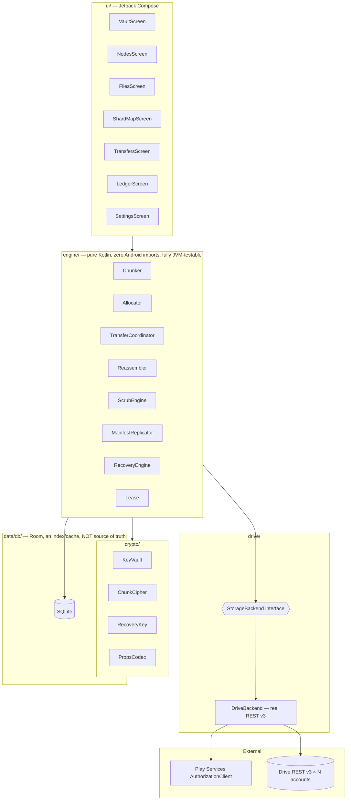
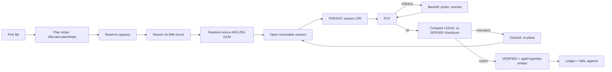

# STRATA — Architecture

> One vault. Many drives. See [SETUP.md](SETUP.md) for the Google Cloud walkthrough and
> [README.md](README.md) for the project overview.

## The central invariant

> **Google Drive holds the truth. Room is a rebuildable cache.**

Every chunk carries its own encrypted metadata in Drive `appProperties`
([`PropsCodec.kt`](app/src/main/java/com/tejgokani/strata/crypto/PropsCodec.kt)). The union of
every chunk's metadata across every connected account is a complete, distributed index. Losing
the local database entirely is survivable — [`RecoveryEngine`](app/src/main/java/com/tejgokani/strata/engine/RecoveryEngine.kt)
rebuilds it by enumerating each account's files and decrypting their properties, cross-checked
against whatever manifest WAL/base snapshots
([`ManifestReplicator`](app/src/main/java/com/tejgokani/strata/engine/ManifestReplicator.kt))
still survive in each account's `appDataFolder`.



## Package map

| Package | Contents |
|---|---|
| [`core/`](app/src/main/java/com/tejgokani/strata/core) | `Result`/`StrataError`, `CanonicalCodec` (deterministic binary encoding), `Clock`, `Hex`, `Formatting` — zero Android deps |
| [`crypto/`](app/src/main/java/com/tejgokani/strata/crypto) | `Kdf` (PBKDF2+HKDF), `ChunkCipher` (AES-256-GCM), `KeyVault`, `RecoveryKey`, `PropsCodec` |
| [`ledger/`](app/src/main/java/com/tejgokani/strata/ledger) | `Ledger` — the hash-chained, tamper-evident event log |
| [`engine/`](app/src/main/java/com/tejgokani/strata/engine) | `Chunker`, `Allocator`, `TransferCoordinator`, `Reassembler`, `ManifestReplicator`, `RecoveryEngine`, `ScrubEngine`, `Lease` — the whole storage engine, pure Kotlin |
| [`drive/`](app/src/main/java/com/tejgokani/strata/drive) | `StorageBackend` interface, `DriveBackend` (real REST v3 over OkHttp), `RateLimiter`, `CircuitBreaker` |
| [`auth/`](app/src/main/java/com/tejgokani/strata/auth) | `AccountAuthorizer` (Play Services), `TokenProvider` (in-memory token cache) |
| [`data/db/`](app/src/main/java/com/tejgokani/strata/data/db) | Room entities, DAOs, `StrataDatabase` (corruption-quarantining, not deleting) |
| [`data/prefs/`](app/src/main/java/com/tejgokani/strata/data/prefs) | `SettingsStore` — device/pool identity, manifest sequence counter, reboot detection |
| [`di/`](app/src/main/java/com/tejgokani/strata/di) | `AppContainer` — the hand-written composition root |
| [`ui/`](app/src/main/java/com/tejgokani/strata/ui) | Compose screens, brutalist data-vault theme/components, ViewModels |

## Write path



Only `PlacementState.VERIFIED` counts as durable
([`TransferCoordinator.kt`](app/src/main/java/com/tejgokani/strata/engine/TransferCoordinator.kt)).
The verify-after-write check compares the ciphertext hash **STRATA computed before sending**
against what the server reports — not two server-side reads against each other, which could
never disagree even if the bytes were corrupted in transit.

## Placement: apportionment, not hashing

[`Allocator.kt`](app/src/main/java/com/tejgokani/strata/engine/Allocator.kt) explicitly rejects
consistent hashing: at N ≤ 20 accounts with rare membership changes, CH would force moving ~1/N
of all data (a re-download-and-re-upload over the user's own network) on every account added or
removed, for no benefit. Placement is recorded explicitly per chunk instead.

- **Initial stripe** — largest-remainder (Hamilton) apportionment, weighted by each account's
  effective free space. Deterministic and low-variance, unlike power-of-two-choices at this
  scale (P2C on a 16-chunk file over 10 accounts routinely dumps 5–6 chunks on one node).
- **Repair** — power-of-two-choices IS used here: cheap, stateless, right for a single
  after-the-fact decision when a node fails mid-stripe.
- **Headroom** — `max(1 GB, 8% of limit)` is a hard floor, not a setting: a 100%-full Drive
  account stops receiving Gmail.

## Crypto

```
passphrase ──PBKDF2-HMAC-SHA256(600k iters)──> masterKey (32B)
                ├─ HKDF ──> dekWrapKey    (wraps each file's random per-file DEK)
                ├─ HKDF ──> appPropsKey    (seals appProperties metadata)
                └─ HKDF ──> manifestKey     (seals manifest WAL/base snapshots)
```

Chunk layout: `nonce(12) ‖ ciphertext ‖ tag(16)`, a fresh `SecureRandom` nonce on every single
encryption call — including retries. Recovery key: Base32(masterKey ‖ checksum), so a mistyped
code is caught immediately rather than silently deriving a wrong key
([`RecoveryKey.kt`](app/src/main/java/com/tejgokani/strata/crypto/RecoveryKey.kt)).

## Ledger — tamper-evident, per-device hash chain

```
hash_n = SHA-256( hash_{n-1} ‖ canonicalBinary(event_n) )
```

Ordered by a persisted per-device Lamport counter, **never** wall-clock time (user-settable, and
unfit for ordering). Canonical binary encoding
([`CanonicalCodec.kt`](app/src/main/java/com/tejgokani/strata/core/CanonicalCodec.kt)) rather than
JSON, because JSON map key ordering is not guaranteed across library versions and the whole point
of the chain is that re-serializing the same logical event always produces the same bytes.

## Recovery: three redundant paths to the same truth

1. **Chunk `appProperties`** — every chunk decrypts to its own placement record. Survives even a
   full wipe of the manifest replicas.
2. **Manifest WAL + base snapshots** in every account's `appDataFolder` — an immutable,
   idempotent log; merging replicas is a set union, so partial visibility across accounts still
   converges to the same result.
3. **Local Room database** — the fast path, always rebuildable from (1) and (2).

`SIMULATE DISASTER RECOVERY` in Settings runs path (1)+(2) live, read-only, against your actual
accounts — see [`RecoveryEngine.kt`](app/src/main/java/com/tejgokani/strata/engine/RecoveryEngine.kt).
The equivalent JVM test wipes the database entirely and proves byte-identical recovery with zero
network access (see Testing, below).

## Concurrency

Per-account `TokenBucket` + `CircuitBreaker`
([`RateLimiter.kt`](app/src/main/java/com/tejgokani/strata/drive/RateLimiter.kt),
[`CircuitBreaker.kt`](app/src/main/java/com/tejgokani/strata/drive/CircuitBreaker.kt)) — one
throttled account never stalls transfers to the rest of the pool. `TokenBucket` keys its refill
clock off `SystemClock.elapsedRealtime()` plus a reboot-detection heuristic
([`SettingsStore.getOrCreateBootId()`](app/src/main/java/com/tejgokani/strata/data/prefs/SettingsStore.kt)),
so a device reboot resets the bucket rather than granting a free burst.

## Testing

```bash
./gradlew testDebugUnitTest   # 58 tests, zero Google accounts, no device, no network
./gradlew assembleDebug       # → app/build/outputs/apk/debug/app-debug.apk
```

`FakeDriveBackend` ([`app/src/test/.../fakes/FakeDriveBackend.kt`](app/src/test/java/com/tejgokani/strata/fakes/FakeDriveBackend.kt))
simulates per-account quota, latency, 429 storms, mid-upload interruption/resume, trashing, and
total node loss — everything the real `DriveBackend` sees, without a network call. Coverage
includes chunking/reassembly round-trips, crypto (tamper/wrong-key detection, nonce uniqueness),
placement proportionality, the resumable-upload interrupt-and-resume path, verify-after-write
catching server-side corruption, mirror failover, manifest WAL idempotent merge, single-writer
lease arbitration, scrub reconciliation (including the admissibility rule — a partial account
listing must produce zero deletions), and two full disaster-recovery drills.

## Honest limitations

- **Not verified against live Drive.** No emulator image or device was available in this build
  pass — see [SETUP.md](SETUP.md)'s "first-run checks" for the two things worth confirming
  yourself early.
- **Single-writer.** A second device sharing the same accounts opens read-only rather than
  attempting a merge.
- **Transfers screen reads persisted placement state**, not a live byte-level progress stream —
  wiring a full WorkManager/foreground-service progress channel end to end was out of scope for
  this pass.
- Full research citations and the risk analysis this design is built on live in the original
  planning document; the numbered findings (R1–R18) referenced above trace back to that.
